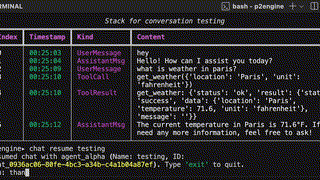
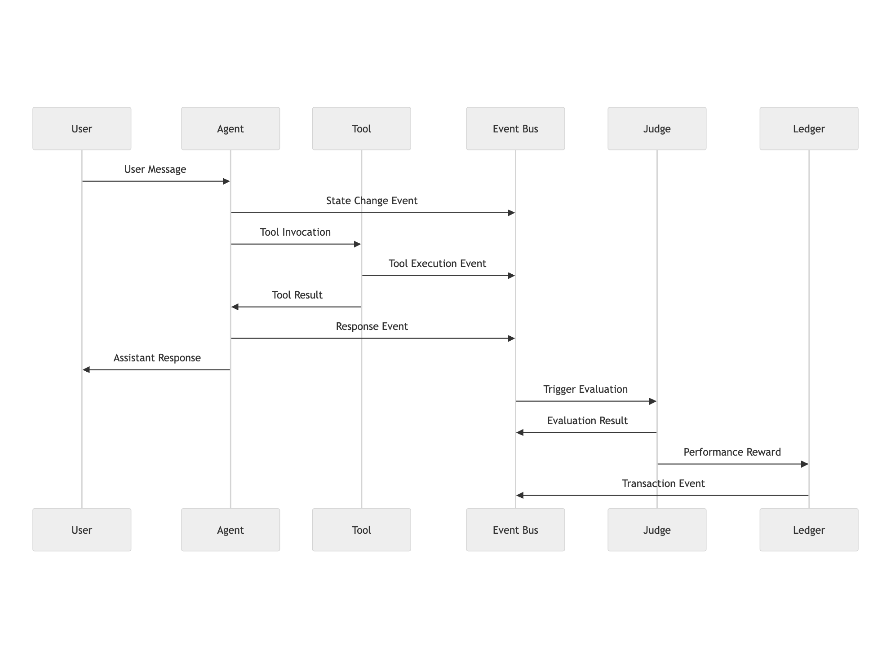

# P2Engine: A Multi-Agent System Framework

**A framework + runtime to build, run, and evaluate multi-agent systems. Extended with the Canton Network to enable monetary incentives, payments, and audits.**

**Coordinate agents, evaluate each step, store trajectories, replay & observe.**

The framework is located in the `p2engine/` directory, with setup instructions and full documentation in `p2engine/README.md`.

I wrote an article. Read the [full backstory, vision, and technical deep-dive](https://www.adamsioud.com/projects/p2engine.html) to understand the motivation and design philosophy behind P2Engine.

[Section 1](#section-1) • [Section 2](#section-2) • [Section 3](#section-3) • [Section 4](#section-4)

---

## Section 1

_Click any demo below for a full video demonstration_

|                                           **Agent Delegation**                                            |                                           **Branch Rewind**                                            |
| :-------------------------------------------------------------------------------------------------------: | :----------------------------------------------------------------------------------------------------: |
| [](https://www.adamsioud.com/projects/p2engine.html?v=e1) | [](https://www.adamsioud.com/projects/p2engine.html?v=e2) |

|                                           **Rollout with Rerun**                                            |                                           **Ledger Operations**                                            |
| :---------------------------------------------------------------------------------------------------------: | :--------------------------------------------------------------------------------------------------------: |
| [](https://www.adamsioud.com/projects/p2engine.html?v=e3) | [](https://www.adamsioud.com/projects/p2engine.html?v=e4) |

**Agent Delegation** — Agents are orchestrated via FSMs, delegate subtasks to specialists, and track conversation state through branching.

**Branch Rewind** — Every agent action and tool invocation is captured in real time, with session and branch identifiers preserving causality.

**Rollout with Rerun** — You can configure rubrics, agent teams, and variants, and then test them across different scenarios and tools.

**Ledger Operations** — Agents maintain wallets on Canton Network, perform autonomous transfers, and all transactions are immutably recorded.

---

## Section 2

At its core, P2Engine runs LLM-agents in discrete steps. Each step produces artifacts, and a separate and async evaluator scores them. You can think of it like this: the agent thinks, acts, and creates something; the evaluator observes, scores, then which is not yet implemented the root/router or evaluator takes the feedback then decides the next tool, step, or configuration.

So To ramble, P2Engine, gives us agent interfaces, tool registry, templates/personas, runtime policies. A pushdown automata esque, it is a finite state machine with an interaction stack. It has branching, rewind, artifacts and an artifacts bus, Redis-backed session/state. Judge prompts, metrics, branch scoring, rollout experimentation. Chat, artifacts inspect/diff, rollouts, ledger ops, conversation watch. Rich logs; optional with rerun views and real-time monitors. And the ledger (Canton/DAML) integration gives us balances, transfers, and audit trails.

---

## Section 3

### Rollouts

<p align="center">
  <a href="https://www.adamsioud.com/projects/p2engine.html?v=hero">
    
  </a>
  <br>
  <em>Rerun Showcase — click to open full viewer</em>
</p>

With P2Engine you can build systems however you like. And rollouts is the place we do this now, they are kind of our , Simulations are executed via rollouts ([runtime/rollout/cli.py](p2engine/runtime/rollout/cli.py)) with configuration files (e.g., [config/rollout_ledger_demo.yml](p2engine/config/rollout_ledger_demo.yml)) defining reproducible scenarios. These demonstrate that p2engine effectively enables coordination across diverse agent roles, ensures traceability through ledger-backed records, manages payments seamlessly, and supports judgment with automated evaluation tools. Results (metrics, visualizations) presented in the thesis empirically validate the system's feasibility and provide foundation for future research directions.

<br>

Rollouts set the stage for adaptation methods. The rollout system provides A/B testing capabilities for systematically comparing different agent configurations, tool combinations, and behavioral parameters. Implemented in the [runtime/rollout/](p2engine/runtime/rollout/) module, it integrates seamlessly with the Celery task system for distributed execution, enabling parallel evaluation of multiple configuration variants. The system uses YAML configuration files to define rollout experiments, specifying teams, base settings, variants, and evaluation criteria.

---

## Section 4

### Architecture Diagrams

|                         **F1 — Real-time Analytics**                         |                          **F2 — Custom Integrations**                          |
| :--------------------------------------------------------------------------: | :----------------------------------------------------------------------------: |
|  |  |

|                        **F3 — Enterprise Security**                         |                        **F4 — Global Deployment**                        |
| :-------------------------------------------------------------------------: | :----------------------------------------------------------------------: |
|  |  |

### System Architecture Overview

**Distributed Computing Layer** — Microservices-based architecture with container orchestration using Kubernetes for auto-scaling and load distribution.

**AI Agent Framework** — Plugin-based agent development with multi-modal agent support and cross-platform compatibility for maximum flexibility.

**Blockchain Integration** — Canton Network integration for financial operations, smart contract templates, and decentralized identity management.

**Data & Analytics** — Real-time data processing with advanced analytics, reporting capabilities, and machine learning pipeline integration.

### Technical Stack

- **Microservices Architecture** — Scalable and maintainable design
- **Container Orchestration** — Kubernetes-based deployment
- **API-First Design** — RESTful and GraphQL endpoints
- **Event-Driven Architecture** — Real-time event processing
- **Security by Design** — End-to-end encryption and authentication
- **Cloud Native** — Built for modern cloud infrastructure

---

## Getting Started

```bash
# Clone the repository
git clone https://github.com/your-username/p2engine.git

# Navigate to the project directory
cd p2engine

# Install dependencies
npm install

# Start the development server
npm run dev
```

For detailed setup instructions, see [`p2engine/README.md`](p2engine/README.md).

---

## Contributing

We welcome contributions! Please read our [Contributing Guide](CONTRIBUTING.md) for details on our code of conduct and the process for submitting pull requests.

## License

This project is licensed under the MIT License - see the [LICENSE](LICENSE) file for details.

## Support

For questions and support, please open an issue or contact us at [support@p2engine.com](mailto:support@p2engine.com).
