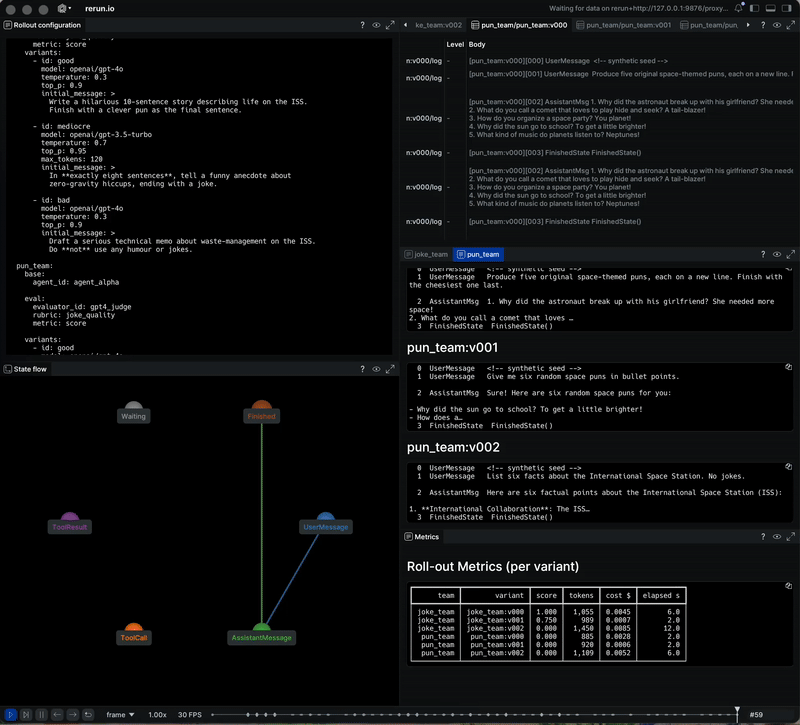
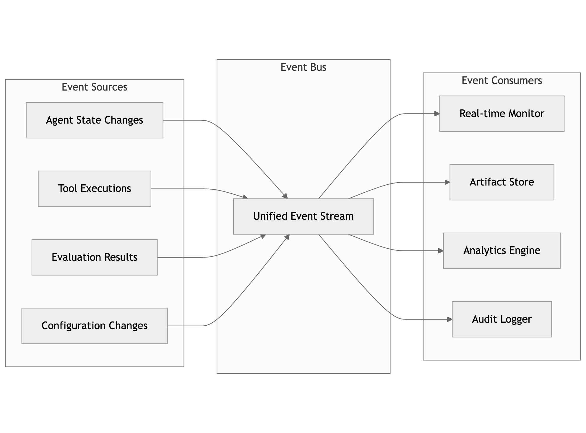
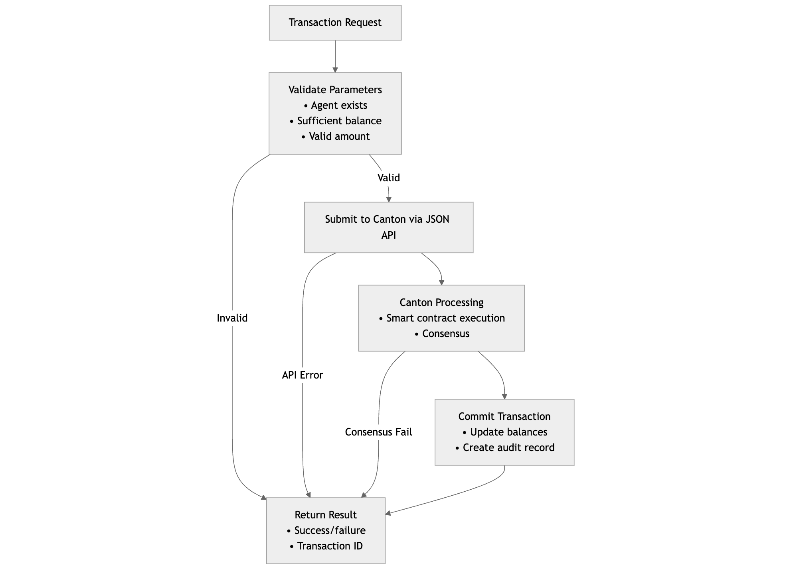

# P2Engine: A Multi-Agent System Framework

**A framework + runtime to build, run, and evaluate multi-agent systems. Extended with the Canton Network to enable monetary incentives, payments, and audits.**

**The framework is located in the `p2engine/` directory, with setup instructions and full documentation in `p2engine/README.md`.**

Coordinate agents, evaluate each step, store trajectories, replay & observe.

Read the [full backstory, vision, and technical deep-dive](https://www.adamsioud.com/projects/p2engine.html) to understand the motivation and design philosophy behind P2Engine.

[Section 1](#section-1) • [Section 2](#section-2) • [Section 3](#section-3) • [Section 4](#section-4)

---

_Click any demo below for a full video demonstration_

|                                           **Agent Delegation**                                            |                                           **Branch Rewind**                                            |
| :-------------------------------------------------------------------------------------------------------: | :----------------------------------------------------------------------------------------------------: |
| [](https://www.adamsioud.com/projects/p2engine.html?v=e1) | [](https://www.adamsioud.com/projects/p2engine.html?v=e2) |

|                                           **Rollout with Rerun**                                            |                                           **Ledger Operations**                                            |
| :---------------------------------------------------------------------------------------------------------: | :--------------------------------------------------------------------------------------------------------: |
| [](https://www.adamsioud.com/projects/p2engine.html?v=e3) | [](https://www.adamsioud.com/projects/p2engine.html?v=e4) |

**Agent Delegation** — Agents are orchestrated via FSMs, delegate subtasks to specialists, and track conversation state through branching.

**Branch Rewind** — Every agent action and tool invocation is captured in real time, with session and branch identifiers preserving causality.

**Rollout with Rerun** — You can configure rubrics, agent teams, and variants, and then test them across different scenarios and tools.

**Ledger Operations** — Agents maintain wallets on Canton Network, perform autonomous transfers, and all transactions are immutably recorded.

---

## Rollout

### Global Rollout Strategy

**Experience seamless deployment across multiple environments with our comprehensive rollout strategy—from local development to enterprise-scale production.**

**Multi-Environment Support** — Development, staging, and production deployments with consistent configuration management across all environments.

**Scalable Infrastructure** — Auto-scaling based on demand with intelligent load distribution and resource optimization.

**Global Distribution** — Edge computing and regional deployment options for reduced latency and improved performance worldwide.

**Enterprise Integration** — Seamless connection with existing enterprise systems through standardized APIs and protocols.

**[Learn More About Deployment →](#deployment)**

[](https://www.adamsioud.com/projects/p2engine.html?v=hero)

_Rerun Showcase — click to open full viewer_

---

## Functionalities

### Core Platform Features

**Multi-Agent Orchestration** — Coordinate complex workflows across multiple AI agents with dynamic task allocation and load balancing for real-time agent communication and collaboration.

**Observable Operations** — Comprehensive monitoring dashboards provide real-time performance metrics and debugging capabilities to trace agent decision paths.

**Adaptive Learning** — Continuous improvement through feedback loops, performance optimization algorithms, and automated model fine-tuning.

**Audit & Compliance** — Complete transaction logging with Canton Network integration for financial transparency and regulatory compliance reporting.

### Key Features

- **Real-time Monitoring** — Live agent performance tracking
- **Dynamic Scaling** — Auto-adjustment based on workload
- **Cross-Platform Support** — Works across all major platforms
- **Plugin Architecture** — Extensible agent development framework
- **Smart Contracts** — Automated payment and incentive systems
- **Enterprise Ready** — Production-grade security and reliability

---

## Architecture Diagrams

|                         **F1 — Real-time Analytics**                         |                          **F2 — Custom Integrations**                          |
| :--------------------------------------------------------------------------: | :----------------------------------------------------------------------------: |
|  |  |

|                        **F3 — Enterprise Security**                         |                        **F4 — Global Deployment**                        |
| :-------------------------------------------------------------------------: | :----------------------------------------------------------------------: |
|  |  |

---

## Architectures

### System Architecture Overview

**Distributed Computing Layer** — Microservices-based architecture with container orchestration using Kubernetes for auto-scaling and load distribution.

**AI Agent Framework** — Plugin-based agent development with multi-modal agent support and cross-platform compatibility for maximum flexibility.

**Blockchain Integration** — Canton Network integration for financial operations, smart contract templates, and decentralized identity management.

**Data & Analytics** — Real-time data processing with advanced analytics, reporting capabilities, and machine learning pipeline integration.

### Technical Stack

- **Microservices Architecture** — Scalable and maintainable design
- **Container Orchestration** — Kubernetes-based deployment
- **API-First Design** — RESTful and GraphQL endpoints
- **Event-Driven Architecture** — Real-time event processing
- **Security by Design** — End-to-end encryption and authentication
- **Cloud Native** — Built for modern cloud infrastructure

---

## Getting Started

```bash
# Clone the repository
git clone https://github.com/your-username/p2engine.git

# Navigate to the project directory
cd p2engine

# Install dependencies
npm install

# Start the development server
npm run dev
```

For detailed setup instructions, see [`p2engine/README.md`](p2engine/README.md).

---

## Contributing

We welcome contributions! Please read our [Contributing Guide](CONTRIBUTING.md) for details on our code of conduct and the process for submitting pull requests.

## License

This project is licensed under the MIT License - see the [LICENSE](LICENSE) file for details.

## Support

For questions and support, please open an issue or contact us at [support@p2engine.com](mailto:support@p2engine.com).
